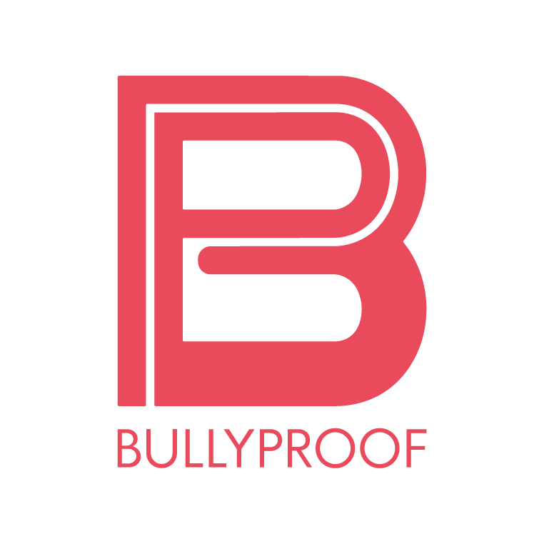

<div style="font-family: 'Helvetica', sans-serif;">
<!-- inserting logo to insert logo here we need to add the logo to the repo and then add the link to the logo here
-->




# Bully Proof Hockey

The Bully Proof Hokey is a campaign dedicated to promoting positive behaviour and ending bullying in the hockey community. It is a Final Integrate Project for Fanshawe College. 

## Team

Our campaign has a team of five dedicated individuals:

- Krystal: Project Manager
- Pablo: Motion Designer
- Ishpreet: Graphic Designer
- Hiral: Front-end Developer
- Cristine: Back-end Developer

## CMS BullyProof

CMS BullyProof is a part of the FIP and the folder has four main parts: lumen, cms, website and database.

Lumen is the folder with the backend of the website and the CMS(Content management system). The backend was developed with the lumen laravel framework.

CMS or Content management system has the files of the system that gets all the registrations and emails from the website. It also updates, detele and creates new events and testimonials cards for the website. The fontend was developed with Javascript, Vue.js, CSS and HTML.

The website shows information about our campaign BullyProof Hockey, actions, events, testimonials, chat and help phone line.

Finally, the database has the updated database used in the project.

To use the CMS you need :

#### 1. import the database to your localhost
#### 2. open cms_bullyproof folder on Visual Studio Code
#### 3. edit the .env file (inside the lumen folder) with your localhost information
#### 4. open the terminal and write:
```  
cd lumen
```
#### 5. then write: 
```  
php -S localhost:8000 -t public
```
#### 6. Now you can open the website or the cms index.html file using the Live Server 

## References
https://github.com/kfurlani/FIP_TeamPage

https://github.com/hiralshah7/bullyproof_hockey

https://lumen.laravel.com/docs/10.x

